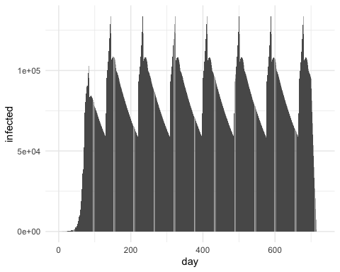
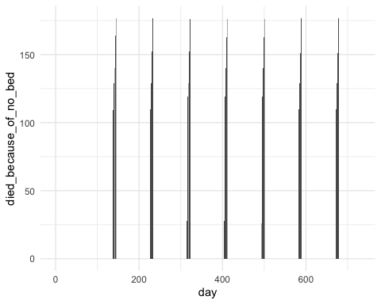
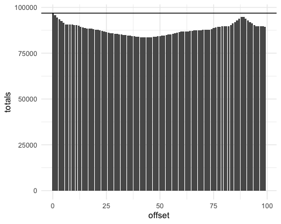
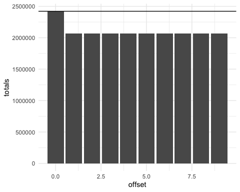
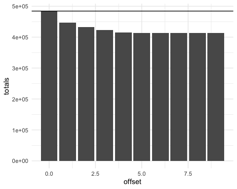
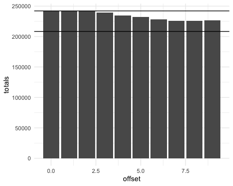
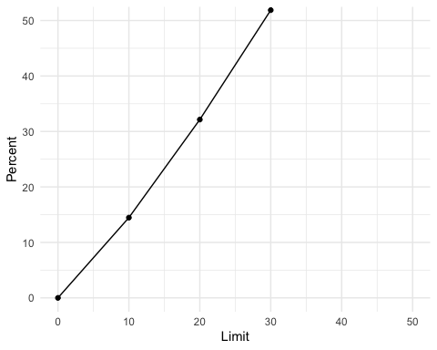

Introduction
============

Purpose of the model
--------------------

This model is designed to demonstrate the possible cost (in lives lost)
of not sharing critical care resources during a pandemic. Its purpose is
not to come up with precise numbers that reflect the actual population
nor to precisely model the pandemic in a specific state. Instead it is
designed to compare the lives lost in imaginary states that are sharing
critical care resources with other states, compared to those that are
not sharing resources during pandemic surges.

Methods
=======

This is a Susceptible Infected Recovered (SIR) model. Each state has a
population of citizens. The pandemic begins with a small number of
infected citizens, and initially spreads based on an initial infection
co-efficient (R0). Once a certain threshold of infection doubling is
reached, the state introduces distancing measures. These measures are
implemented after a delay. Once in place, the infection co-efficient
becomes the effective transmission during distancing (Rt). Once the
number of infections per 100,000 population drops below a threshold,
distancing measures are relaxed after a delay, and return to the
original R0.

A proportion of the infected patients become severely ill. Mildly ill do
not require hospital level care. Moderately ill patients require
hospital level care but do not require critical care. Severely ill
patients require critical care services, such as ventilation or
pressors. Without these critical care services, the patients are
expected to die. Only severely ill patients are specifically identified
in the model.

Different resource control strategies for assigning critical care beds
are included in the model. These include:

-   no sharing (that is each state has its own critical care beds only)
-   sharing (that is all states that are part of that resource control
    share all beds)
-   limited sharing (that is states that are part of that resource
    control share beds with other states, only up to a certain limit.
    For example, a 10% limit would mean that 10% of the beds are always
    reserved for local use only. Once there are fewer than 10% of beds
    available in a state, they are not available for out of state
    transfers.)

Parameters
----------

The data in the model is based on data for the state of Massachusetts.

The state has a population of 4,000,000 people.

Based on the current US average^1^ of 2.77 hospital beds per 1,000
population, and 29.4, this population would have 11,080 hospital beds
and would have 1176 ICU beds. Some number of hospital beds can be used
as ICU beds. Based on our experience during COVID, we have estimated
that 1/3 of hospital beds can be used as ICU beds if needed.

For simplicity, we will assume that the states have equal resources. We
know that in reality the number of hospital beds varies from 1.7 per
1,000 in some states to 4.8 in others^2^.

R0 is defined as the R0 that occurred initially in MA = 4.93^3^

Rt is the effective transmission during social distancing = 1.01^4^

The rate of severe illness for infected patients is estimated at 5%
based on published data, we have used a conservative estimate of 3.5% in
our model^5^. Estimates of mortality from China initially suggested a
mortality rate of 1.4%^6^ while those in Italy were up to 11%^7^. We
used a conservative estimate of 1% mortality in our model.

Results
=======

Baseline: no sharing
--------------------

Results for a single state, show the cycles of infection, and the usage
of available critical care beds.

Even with our conservative estimates, we can see that during surges, the
number of severely ill exceeded the number of critical care beds
available. With no sharing the *excess mortality* of people who will die
because there are not enough ICU beds is estimated to be 7,107.

Scenario: 2 states sharing vs not sharing
-----------------------------------------

The line shows the lives lost without sharing. Below the line we see the
lives lost when there is sharing. The lives saved varies based on how
much later the pandemics started (the offset).

When the pandemics completely overlap then no additional lives are
saved.

If the peaks do not overlap, the maximum lives saved is estimated to be
13,150.

Scenario: 50 states sharing vs not sharing
------------------------------------------

In the scenario of all states being able to share all resources, the
system reaches the optimum (with no lives lost due to a critical care
shortage) very quickly.

The lives saved is estimated as 352,049.

Scenario: Regional sharing only (10 states only)
------------------------------------------------

There are unfortunately limits on the distances that most critically ill
patients can be transported. This could be overcome by transporting
providers and equipment instead so the 50 state scenario with maximal
sharing is possible.

To understand what a more realistic scenario of regional sharing and
likely regional pandemics would look like, we modelled sharing with only
10 states shared (such as might happen in the NorthEast).

The maximum lives saved for only 10 stated sharing is estimated as
70,405.

Scenario: Limits on sharing
---------------------------

There is a cost in both patient outcomes (in the case of delayed
surgeries) and economic costs (in lost revenue) in sharing hospital
resources maximally. We therefore modeled the ability for hospitals to
limit the number of beds that they share, as described above.

This limits the overall global maximum of lives saved due to a lack of
critical care resources, but some of this could be offset by decreased
mortality from delays in care (such as delayed surgeries that would
require critical care resources after). We do not have sufficient data
to be able to model or adjust for this.

The lower line indicates the maximum lives saved with full sharing.

The effect of limiting sharing has a greater than linear effect on
worsening mortality across the whole system.

This graphs shows the decrease in percentage of lives saved when a
percentage of beds are limited in each state.

Discussion
==========

This simple model of susceptible, infected and recovered within states
that have variable infection co-efficients based on distancing or not
distancing strategies demonstrate pandemic dynamics. It has allowed us
to model possible critical needs for these populations, and to
investigate the effect of different sharing strategies on overall and
state mortality.

References {#references-1}
==========

^1^ <https://en.wikipedia.org/wiki/List_of_countries_by_hospital_beds>

^2^
<https://www.kff.org/other/state-indicator/beds-by-ownership/?currentTimeframe=0&sortModel=%7B%22colId%22:%22Location%22,%22sort%22:%22asc%22%7D>

^3^ <https://modelingcovid.com/state/MA>

^4^ Covid Modelling from Dr Dryden Peterson for Mass General Brigham

^5^ Berlin, David A., Roy M. Gulick, and Fernando J. Martinez. "Severe
Covid-19." New England Journal of Medicine 0, no. 0 (May 15, 2020):
null. <https://doi.org/10.1056/NEJMcp2009575>.

^6^ Guan, Wei-jie, Zheng-yi Ni, Yu Hu, Wen-hua Liang, Chun-quan Ou,
Jian-xing He, Lei Liu, et al. "Clinical Characteristics of Coronavirus
Disease 2019 in China." New England Journal of Medicine 382, no. 18
(April 30, 2020): 1708--20. <https://doi.org/10.1056/NEJMoa2002032>.

^7^ Boccia, Stefania, Walter Ricciardi, and John P. A. Ioannidis. "What
Other Countries Can Learn From Italy During the COVID-19 Pandemic." JAMA
Internal Medicine, April 7, 2020.
<https://doi.org/10.1001/jamainternmed.2020.1447>.
